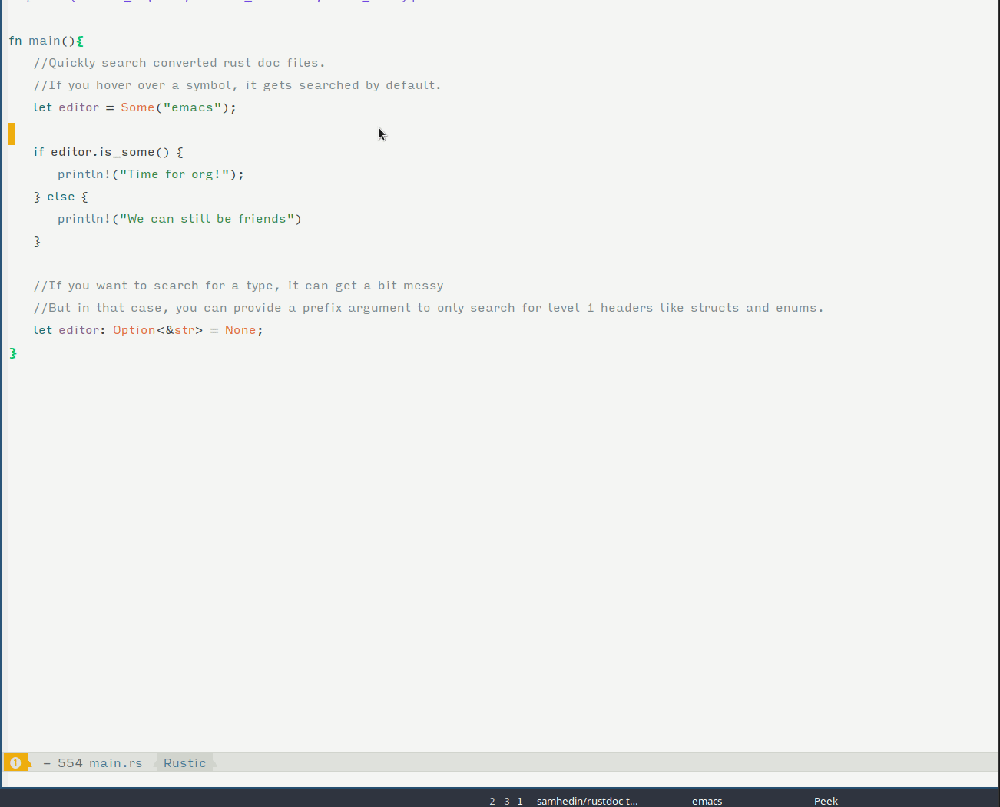

# Rustdoc to org
A Pandoc filter that converts rust documentation to .org-files! This is still in a very early state and there are many improvements to work on, hopefully this can end up helping someone.


## Installation
* Install Pandoc https://pandoc.org/
* Download and install rustdoc-to-org: `wget https://github.com/samhedin/rustdoc-to-org/releases/download/v0.1/rustdoc-to-org-exe; sudo cp rustdoc-to-org-exe ~/.local/usr/bin`, make sure that `~/.local/usr/bin` is in your `PATH`.
* Locate a rustdoc html file you wish to convert, and run `pandoc <file> --filter rustoc-to-org-exe -o outfile.org`

### Batch convert
You can generate all `.html` files for std by running `rustup doc`, which will put the files somewhere in `~/.rustup/`, in my case in `~/.rustup/toolchains/stable-x86_64-unknown-linux-gnu/share/doc/rust/html/std/)`.
You can then convert all of them with `batch_convert.sh`.
`sh batch_convert.sh <input_dir> <output_dir>`

## Misc
I use it with [Helm ag](https://github.com/bridgesense/emacs-helm-ag), setting dir to the previously used output dir.
``` emacs-lisp
(defun search-rustdoc ()
    (interactive)
    (let ((helm-ag-base-command "rg --smart-case --no-heading --color=never --line-number")
          (helm-ag-insert-at-point 'symbol))
      (helm-do-ag "/home/sam/.emacs.d/private/rustdoc")))

  (global-set-key (kbd "C-c C-g") 'search-rustdoc)
  ```

## TODO
* Figure out a way to get links working. All links point to .html files, they should be updated to point to .org files.
* Make code not awful and not slow.
* Pandoc seems to be keen on inserting extra linebreaks between sections. For example, there is an extra linebreak after each header. It would be nice to remove this.
* There is a redundant title string before the actual Header title, which should be removed.
* Examples should use rust syntax highlighting, but I could not figure out how to do it.
* Fill out this list.

All suggestions, comments and more are welcomed!
